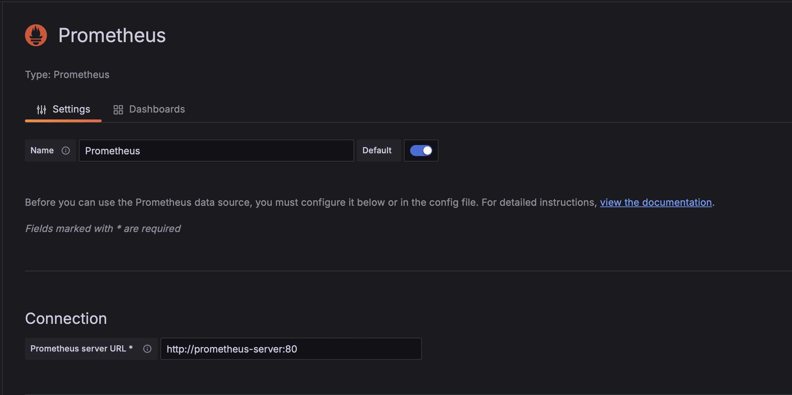

# Dashboard

A simple dashboard to display 9 grafana dashboards using iframes.

## Setup

1. Run the setup-minikube.sh script to setup a local minikube cluster with grafana and prometheus.
2. Run the following commands to expose the grafana and prometheus services in separate terminals. This will open the services in the default browser.

    ```bash
    minikube service grafana-np
    ```

    ```bash
    minikube service prometheus-np
    ```

3. Add the datasource to the grafana instance using the server url: `http://prometheus-server:80` and the access:
    
4. Add a dashboard to the grafana instance. E.g: `6417`.
5. Expose the dashboard using the share option and generate the iframe link.
6. Port forward the grfana pod to the local machine using the following command:

    ```bash
    kubectl port-forward $(kubectl get pods --selector=app.kubernetes.io/name=grafana -o jsonpath='{.items[0].metadata.name}') 3000
    ```

7. Update the `app/index.html` file with the iframe links generated from the grafana dashboards.
